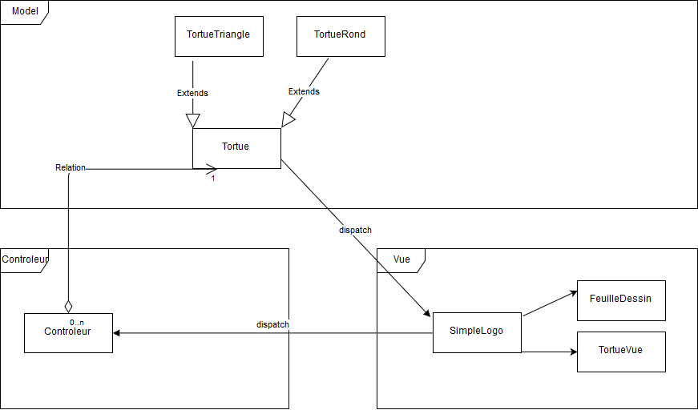

**Bertrand Axel** **Bontron Julien**

# Rapport TP4

## Question 1
*Voici les problèmes que nous avons remarqué lors de notre première lecture du code:*
* Ce code ne respecte pas le modèle MVC car les couches (Model, Vue et Controlleur) sont mélangées dans les différentes classes.

* Le nommage des variales est fait en Anglais et en Français, il faut le mettre dans une seule et même langue, ici le français serait plus simple à mettre en place. 
* Le nommage des variables et des fonctions ne correspondt pas toujours à l'action effectué ou n'est pas compréhensible (exemple : t pour tortue).
* Certaines variables et fonctions ne sont jamais utilisées cela correspond à du code mort.
* Dans la classe FeuilleDessin, nous avons plusieurs `for(Iterator it = tortues.iterator();it.hasNext();)` ceci correspond à des anciennes façons de dévelloper en java.
* Dans la classe SimpleLogo : 
    * la variable colorString : ```String[] colorStrings = {"noir", "bleu", "cyan","gris fonce","rouge","vert", "gris clair", "magenta", "orange","gris", "rose", "jaune"};``` dépend de l'ordre où sont lister les couleurs.
    * la fonction actonPerformed n'est pas SOLID car elle ne permet pas d'ajouter de nouvelles fonctionnalités : 
    ```
    public void actionPerformed(ActionEvent e)
       	{
       		String c = e.getActionCommand();
       
       		// actions des boutons du haut
       		if (c.equals("Avancer")) {
       			System.out.println("command avancer");
       			try {
       				int v = Integer.parseInt(inputValue.getText());
       				courante.avancer(v);
       			} catch (NumberFormatException ex){
       				System.err.println("ce n'est pas un nombre : " + inputValue.getText());
       			}
       			
       		}
       		else if (c.equals("Droite")) {
       			try {
       				int v = Integer.parseInt(inputValue.getText());
       				courante.droite(v);
       			} catch (NumberFormatException ex){
       				System.err.println("ce n'est pas un nombre : " + inputValue.getText());
       			}
       		}
       		else if (c.equals("Gauche")) {
       			try {
       				int v = Integer.parseInt(inputValue.getText());
       				courante.gauche(v);
       			} catch (NumberFormatException ex){
       				System.err.println("ce n'est pas un nombre : " + inputValue.getText());
       			}
       		}
       		else if (c.equals("Lever")) 
       			courante.leverCrayon();
       		else if (c.equals("Baisser"))
       			courante.baisserCrayon();
       		// actions des boutons du bas
       		else if (c.equals("Proc1"))
       			proc1();
       		else if (c.equals("Proc2"))
       			proc2();
       		else if (c.equals("Proc3"))
       			proc3();
       		else if (c.equals("Effacer"))
       			effacer();
       		else if (c.equals("Quitter"))
       			quitter();
       
       		feuille.repaint();
       	}```
* Dans la classe Tortue:
    * la fonction decodeColor n'est pas SOLID car elle ne permet pas d'ajouter de nouvelles fonctionnalités :
    ```
     protected Color decodeColor(int c) {
     		switch(c) {
     			case 0: return(Color.black);
     			case 1: return(Color.blue);
     			case 2: return(Color.cyan);
     			case 3: return(Color.darkGray);
     			case 4: return(Color.red);
     			case 5: return(Colonr.green);
     			case 6: return(Color.lightGray);
     			case 7: return(Color.magenta);
     			case 8: return(Color.orange);
     			case 9: return(Color.gray);
     			case 10: return(Color.pink);
     			case 11: return(Color.yellow);
     			default : return(Color.black);
     		}
     	}
    ```
    * la fonction couleurSuivante n'est pas appelée dans la fonction spiral
    ```
    public void couleurSuivante() {
    	 	couleur(coul+1);
    	}
    	
    public void spiral(int n, int k, int a) {
        	for (int i = 0; i < k; i++) {
        			couleur(coul+1);
        			avancer(n);
        			droite(360/a);
        			n = n+1;
        	}
        }
    ```
    
    
## Question 2
Voici le model UML afin de mettre notre projet en MVC.


## Question 3
*Rien à rédiger*

## Question 4
*Rien à rédiger*

## Question 5
*Expliquer le code ajouté et représenter le patron de conception*

## Question 6
*Rien à rédiger*

## Question 7
*Rien à rédiger*

## Question 8
*Expliquer l'intérêt du mock*

## Question 9
*Montrer les résultats de vos rapports d'analyse*

## Question 10
*Rien à rédiger*
