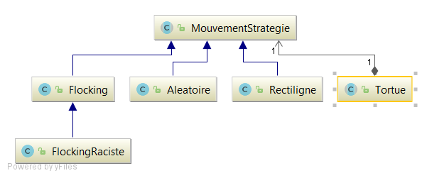

**Bertrand Axel** **Bontron Julien**

# Rapport TP4

## Question 1
*Voici les problèmes que nous avons remarqué lors de notre première lecture du code:*
* Ce code ne respecte pas le modèle MVC car les couches (Model, Vue et Controlleur) sont mélangées dans les différentes classes.

* Le nommage des variales est fait en Anglais et en Français, il faut le mettre dans une seule et même langue, ici le français serait plus simple à mettre en place. 
* Le nommage des variables et des fonctions ne correspondt pas toujours à l'action effectué ou n'est pas compréhensible (exemple : t pour tortue).
* Certaines variables et fonctions ne sont jamais utilisées cela correspond à du code mort.
* Dans la classe FeuilleDessin, nous avons plusieurs 
```
for(Iterator it = tortues.iterator();it.hasNext();)
``` 
ceci correspond à des anciennes façons de dévelloper en java.
* Dans la classe SimpleLogo : 
    * la variable colorString : 
```
String[] colorStrings = {"noir", "bleu", "cyan","gris fonce","rouge","vert", "gris clair", "magenta", "orange","gris", "rose", "jaune"};
``` 
dépend de l'ordre où sont lister les couleurs.
    * la fonction actonPerformed n'est pas SOLID car elle ne permet pas d'ajouter de nouvelles fonctionnalités : 
 ```
    public void actionPerformed(ActionEvent e)
       	{
       		String c = e.getActionCommand();
       
       		// actions des boutons du haut
       		if (c.equals("Avancer")) {
       			System.out.println("command avancer");
       			try {
       				int v = Integer.parseInt(inputValue.getText());
       				courante.avancer(v);
       			} catch (NumberFormatException ex){
       				System.err.println("ce n'est pas un nombre : " + inputValue.getText());
       			}
       			
       		}
       		else if (c.equals("Droite")) {
       			try {
       				int v = Integer.parseInt(inputValue.getText());
       				courante.droite(v);
       			} catch (NumberFormatException ex){
       				System.err.println("ce n'est pas un nombre : " + inputValue.getText());
       			}
       		}
       		else if (c.equals("Gauche")) {
       			try {
       				int v = Integer.parseInt(inputValue.getText());
       				courante.gauche(v);
       			} catch (NumberFormatException ex){
       				System.err.println("ce n'est pas un nombre : " + inputValue.getText());
       			}
       		}
       		else if (c.equals("Lever")) 
       			courante.leverCrayon();
       		else if (c.equals("Baisser"))
       			courante.baisserCrayon();
       		// actions des boutons du bas
       		else if (c.equals("Proc1"))
       			proc1();
       		else if (c.equals("Proc2"))
       			proc2();
       		else if (c.equals("Proc3"))
       			proc3();
       		else if (c.equals("Effacer"))
       			effacer();
       		else if (c.equals("Quitter"))
       			quitter();
       
       		feuille.repaint();
       	}
```
* Dans la classe Tortue:
    * la fonction decodeColor n'est pas SOLID car elle ne permet pas d'ajouter de nouvelles fonctionnalités :
```
     protected Color decodeColor(int c) {
     		switch(c) {
     			case 0: return(Color.black);
     			case 1: return(Color.blue);
     			case 2: return(Color.cyan);
     			case 3: return(Color.darkGray);
     			case 4: return(Color.red);
     			case 5: return(Colonr.green);
     			case 6: return(Color.lightGray);
     			case 7: return(Color.magenta);
     			case 8: return(Color.orange);
     			case 9: return(Color.gray);
     			case 10: return(Color.pink);
     			case 11: return(Color.yellow);
     			default : return(Color.black);
     		}
     	}
```
    * la fonction couleurSuivante n'est pas appelée dans la fonction spiral
```
    public void couleurSuivante() {
    	 	couleur(coul+1);
    	}
    	
    public void spiral(int n, int k, int a) {
        	for (int i = 0; i < k; i++) {
        			couleur(coul+1);
        			avancer(n);
        			droite(360/a);
        			n = n+1;
        	}
        }
```
    
    
## Question 2
Voici le model UML afin de mettre notre projet en MVC.


## Question finale 

Au démarrage de l'application, un menu de sélection s'affiche permettant de sélectionner le type de déplacement des tortues. 


Nous avons donc créé les trois modes de déplacement des tortues. 
Tout d'abord, les tortues dépendantes, ce sont des tortues qu'il faut déplacer manuellement grâce au bouton de l'interface graphique. 


Comme nous pouvons le voir sur l'image, nous pouvons faire avancer, tourner à gauche ou à droite, ajouter des torutes de la couleur sélectionnée dans le menu couleur. 
Nous pouvons également vider le terrain afin de recommencer. Nous pouvons également utilisé les boutons du bas pour faire un carré, un polygone ou une spiral, cependant nous ne verrons pas le résultat car nous ne dessinons pas ces formes à l'aide d'un stylo. 

Au niveau implémentation du controleur, nous avons créé une interface ActionHandler qui, en prenant en paramètre le controleur, le model et la vue, permet d'exécuter une action simple de l'application. Le controlleur possède un hmap en attribut permettant de faire lier une commabde (textuelle provenant de la vue) à un ActionHandler particulier. Par exemple, ajouter une tortue sur le terrain. Voir UML suivant:


Ensuite, les tortues autonomes sont des tortues qui se déplacement aléatoirement dans l'espace. 


Pour mettre en place le déplacement autonome, il a fallu modifier le model de la classe tortue pour implémenter un pattern stratégie. 
```java 
public void avancer() {
  mouvement.bouger(this);
}
```


Enfin, le dernier mouvement que nous avons implémenté est le flocking. Le floking est facilement implémentable comme une stratégie particulière de mouvement et a donc été simple à intégrer à l'architecture déjà existante. Le flocking utilise une fonction permettant à la stratégie de lister les voisins de la tortue contrôlée et influencer le flocking. Par conséquent, il est donc facile de surcharger cette fonction pour implémenter des flocking différents. Par exemple, nous avons implémenté le flocking raciste qui effectue un flocking en fonction de la couleur de la tortue. 

De plus, une des dernières fonctionnalités que nous avons implémenté est la gestion des différentes formes de tortue dans la vue. Pour pouvoir dessiner correctement une tortue en fonction de son type (rond, cerf-volant ou triangle) nous avons mis en place un pattern factory en essayant de le rendre capable de créer dynamiquement une vue adaptée au type de tortue du model. La factory prend en argument une instance de tortue et cherche la vue correspondante à partir du nom de la classe. Ainsi une tortue de classe 'model.tortue.TortueTraingle' provoquera la création d'une instance de 'vue.tortue.TortueTriangleVue'. Cette implémentation rend  plus rigide l'architecture du code qu'elle ne le serait avec d'autres mais a été choisi pour respecter au mieux la séapartion model-vue du model MVC. 

Nous pouvons conclure que nous avons terminé toutes les fonctionnalités demandées dans ce projet et que nous en avons même ajouté (différentes formes de tortue). Nous avons essayé de respecter au mieux le model mvc et les conventions visant à produire un code SOLID et propre. ù
